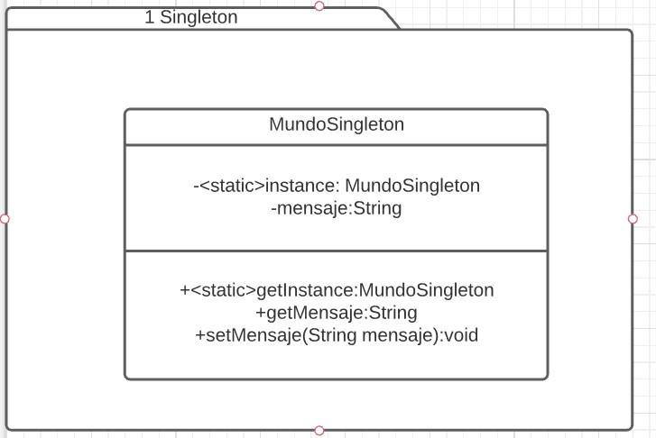

# Singleton
Demo del patron singleton

Singleton es un patron del tipo creacional.
[Link descripción] (https://sourcemaking.com/design_patterns)

Singleton, es usado cuando tenemos una clase que debe tener 1 sola instancia (Y solo una) en toda la aplicación, en lugar de que cada dependencia del código instancie una clase singleton mediante el uso de la palabra new, se declara un constructor privado para evitarlo a lo largo del sistema y se genera un metodo estático que devuelva la instancia ya existente del singleton.

## Diagrama de clases

## SOLID

* Single responsibility:
	Depende de la implementación de la clase en realidad ya que las "razones para cambiar" están muy atadas a la función de la clase en sí mas que al patron singleton en si

* Open/Closed principle
	Si la instanciación de la clase cambia tendremos que modificar el método getInstance indefectiblemente, por lo que sería mejor utilizar un factory para esto. Aunque a su vez el factory también tiene que cambiar cuando cambia el constructor por lo que seguiría rompiendo, a menos que utilicemos un framework tipo spring para mitigarlo.

* Liskov Substitution
	No habría conflicto con este principio, cualquier clase derivada tendría que comportarse correctamente.

* Interface Segregation
	No hay restricciones para la implementación de este principio.

* Dependency inversión.
	Para que esté principio esté aplicado basta con recibir las dependencias por el método getInstance o utilizar un framework tipo Spring.
	
	

